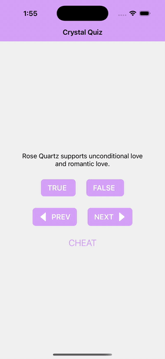

# Crystal Quiz

A small cross-platform quiz app about crystals—answer true/false questions, read explanations, and browse questions at your own pace.

## Demo



*GIF loops automatically in GitHub and most Markdown viewers.*

## What it is

**Crystal Quiz** is a personal portfolio project: an interactive true/false trivia experience focused on crystal lore (for example, properties often associated with stones like rose quartz or black tourmaline). It demonstrates mobile UI patterns, state handling, and navigation in a real app shell—not just a static demo.

## Highlights

- **Quiz flow** — True/false answers with immediate feedback and short explanations.
- **Navigation** — Move between questions; optional “peek” screen for the current question’s answer.
- **Responsive layout** — Button spacing adapts when the device rotates (portrait vs landscape).

## Tech stack

- **React Native** with **Expo** (SDK 53)
- **TypeScript**
- **Expo Router** for file-based routing
- **React 19**

Runs on **iOS**, **Android**, and **web** via Expo.

## Run it locally

```bash
npm install
npm start
```

Then open in the Expo Go app or press `i` / `a` / `w` for iOS simulator, Android emulator, or web.

---

*Portfolio piece — built to showcase React Native, TypeScript, and mobile UX.*
